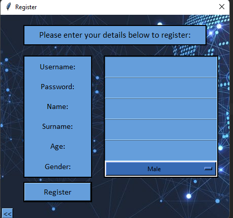
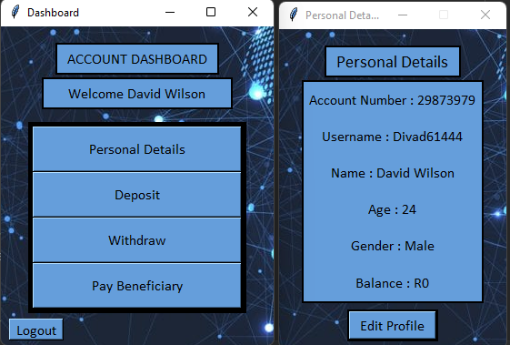
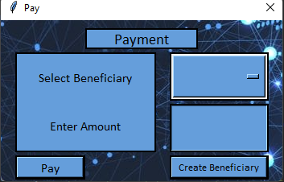

## About
This is a simple and intuative banking app created entirely by me using the tkinter library of Python.

## Installation
1. Install the latest version of python from https://www.python.org/downloads/
2. Simply clone the repository to your local machine.
3. Make sure to download and import the required libraries.

.png)

## Features:

### 1. Letting the user register an account and login by creating a .txt file with their details on it, randomly generating a account number for them too.

### 2. Allow users to see their personal details and edit them on the Profile Section.

### 3. Allow users to save and pay different benificiaries saved on within the file system.

### 4. Paying and Withdrawing funds from your account.

.png)

## Contributions

This was mostly done by myself but would like to thank Sergio from School of IT as my lecturer at the time for assisting and guiding in the process.

Check them out at:
https://schoolofit.co.za/

